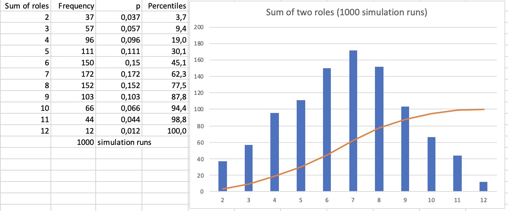
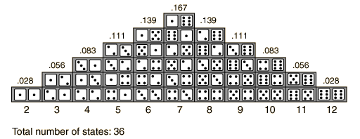

# Monte Carlo Forecasting Analysis
Forecasting is understood as prediction based on historical data. Example:

> Predict the next roll of a dice based on previous rolls, e.g. [4,5,6,2,1,5,3,3,4,1,4,1,2,2,4,6,3,5,1].

Based on the historical data a probability distribution can be calculated:

| Rolled | Frequency (f) | Probability (p)	 | Percentile |
|:---:|:---:|:---:|:---:|
| 1	 | 4 | 0,21 | 21%
| 2	 | 3 | 0,16 | 37%
| 3	 | 3 | 0,16 | 53%
| 4	 | 4 | 0,21 | 74%
| 5	 | 3 | 0,16 | 89%
| 6	 | 2 | 0,11 | 100%

## Forecasting a single event
Answering the question "What's the next roll most likely going to be?" means making a forecast. An answer can be found by looking up the probabilities in a distribution.

According to the above observation-based distribution `1` and `4` are the most likely next rolls (both with an individual probability of 0,21).

But also: The probability of the next roll being `3` *or less* is 0,53.

Of course historical data usually is not needed with dice. The probabilities are obvious from the beginning: for every face of the dice it's 1/6=0,1667. At least if the dice is fair.

However, if it's not known if a dice is fair or with any other events with unkown a priori probabilities historical data can be used to calculate (more correctly: approximate) probabilities.

**Terminology**

* **Event**: Something that can happen, e.g. when roling a dice there are six possible events: `1`, `2`, `3`, `4`, `5`, `6`.
* **Type** of event: *face of dice* or *side of coin*
* **Observation**: an event that happened, e.g. a dice was rolled and shows a `2`.
* **Historical data**: a log of observations
* **Probability**: Likelihood that an event will be observed. Calculated by dividing the number of observations (e.g. 2) of a certain event (e.g. `6`) by the total number of observations (e.g. 19), e.g. 2/19=0,11.
* **Percentile**: Percentage of observations up to and including a certain event (e.g. `3`) in a distribution ordered by event (e.g. `[1,2,3,4,5,6]`), e.g. (4+3+3)/19x100=53%. The percentile can be interpreted as the probability of an event being one from a set of events, e.g. the probability of roling a `1` *or* `2` *or* `3` (read: a `3` *or less*) is 0,53. Pre-requisite: events are independent of each other.

## Forecasting combinations of events
"What's the probability of the next two rolls of a dice being first `2` and then `4`?" or "What's the 'risk' of the the sum of the next two rolls of a dice being 6 or lower?"

The answer to such questions could be calculated based on the distribution of single events, e.g. 0,16x0,21=0,034 for the "first `2` then `4`" question. (The answer is more optimistic based on just observed data than it should be if all events were assumed to be equally probable as it is true with a fair dice: 0,16x0,16=0,026.)

Or the answer could be looked up in the distribution as well.

Combinations of events are events, too; they define a new type of event with its own events, e.g.

* Two consecutive rolls being first `2` and then `4`: `[true, false]`
* Sum of two consecutive rolls: `[2..12]`

Again, for example the "first `2` then `4`" question. Looking at the above historical data there are these relevant observed pairs of events:

```
[
(4,5),
(5,6),
(6,2),
(2,1),
(1,5),
(3,3),
(3,4),
(4,1),
(1,4),
(4,1),
(1,2),
(2,2),
(2,4),
(4,6),
(6,3),
(3,5),
(5,1)
]
```

which can be mapped onto the combined event type:

```
[
false,
false,
false,
false,
false,
false,
false,
false,
false,
false,
false,
false,
true,
false,
false,
false,
false
]
```

From this the following distribution is derived:

| Event | Frequency (f) | Probability (p) |
|:---:|:---:|:---:|
| true	 | 1 | 0,058 |
| false | 16 | 0,94 |

(No percentile is given since there are only two events and there is no order between `true`/`false`.)

As it turns out, the answer taken from the distribution is more optimistic than the calculated answer: 0,058 > 0,034. Why's that? Maybe it's because the number of combined events is small, smaller at least than for single events: 17 < 19.

But how could the number of combined events be increased?

### Monte Carlo forecasting
If combined events are scarce in historical data, their occurence can be simulated by creating new ones *based on* the historical data.

That's what Monte Carlo (MC) simulation is about.

In a MC simulation a combined event is created by randomly selecting single events from the historical data - and not only once, but many times.

For the above questions a combined event is formed from two single events. It's a tuple of the general form `(some single event, some single event)` or more specifically in these cases

```
(rnd(4,5,6,2,1,5,3,3,4,1,4,1,2,2,4,6,3,5,1),
 rnd(4,5,6,2,1,5,3,3,4,1,4,1,2,2,4,6,3,5,1))
```

With `rnd(...)` meaning *a random value from the list of values*. `rnd()` treats all entries in the list with equal probability of 1/length-of-list, e.g. in this case 1/19. That leads to tuples in which events occurr according to their probabilities based on the historical data.

For example, a `(1,4)` combination will be more frequent than a `(1,6)` combination - at least if a large number of combinations are simulated. This can be easily done for this specific example with the following code:

```
var rnd = new Random();
    
var historical_data = new[] {4, 5, 6, 2, 1, 5, 3, 3, 4, 1, 4, 1, 2, 2, 4, 6, 3, 5, 1};

int PickSingleEvent() => historical_data[rnd.Next(historical_data.Length)];
(int, int) SimulateCombinedEvent() => (PickSingleEvent(), PickSingleEvent());
IEnumerable<(int,int)> MCSimulation(int n) => Enumerable.Range(1,n).Select(_ => SimulateCombinedEvent());

var simulations = MCSimulation(1000);
```

`simulations` would contain 1000 tuples like this:

```
[
(4, 2),
(4, 5),
(5, 1),
...
]
```

They can be taken as simulated historical data and interpreted according to the question specific event types, e.g.

* `[false,false,false,...]`
* `[6,9,6,...]`

A forecast based on these events then for example would lead to this distribution for question 2 (bars representing frequencies, line representing percentiles):



Based on this the answer to question 2 would be: "The risk of the next two rolls summing up to 6 or less is 0,45." (45,1% of all observations are sums of 6 or less.)

Compare this to the "true" distribution for a fair dice:



([Image Source](http://hyperphysics.phy-astr.gsu.edu/hbase/Math/dice.html))

They look pretty similar which is a testament to the validity of the MC technique but also to the small set of historical data causing a skew.

The result can be obtained by the following code:

```
int Q2Interpretation((int first, int second) e) => e.first + e.second;

(S e, int f)[] Histogram<S, T>(IEnumerable<T> historicalData, Func<T, S> getKey)
    => historicalData.GroupBy(getKey)
                     .OrderBy(x => x.Key)
                     .Select(x => (x.Key, x.Count()))
                     .ToArray();
                     
(S e, int f, double p, double percentile)[] Distribution<S>((S e, int f)[] histogram) {
    var n = (double)histogram.Sum(x => x.f);
    var percentile = 0.0;
    return histogram.OrderBy(x => x.e)
                    .Select(x => {
                                    var p = x.f / n;
                                    percentile += p;
                                    return (x.e, x.f, p, percentile * 100.0);
                                 })
                    .ToArray();
}

var simulatedHistoricalDataQ2 = simulations.Select(Q2Interpretation).ToArray();
var histogramQ2 = Histogram(simulatedHistoricalDataQ2, x => x);
var distributionQ2 = Distribution(histogramQ2);
```

First the simulated tuples have to be interpreted according to the question's event type. Then a histogram is calculated from which a distribution is derived.

```
bool Q1Interpretation((int first, int second) e) 
    => e.first == 2 && e.second == 4;
```

And here are simulated results for question 1:

| Result | Frequency (f) | Probability (p) | Percentile |
|:---:|:---:|:---:|:---:|
| true | 30 | 0,03 | 3%
| false | 970 | 0,97 | 97%

Now the answer (p=0,03) is much closer to the calcuated one (p=0,034). Simulating 1000 times two rolls obviously leads to a more realistic forecast than just looking at the limited historical data (p=0,058).

## Summary
Forecasting is about looking up probabilities for events in a distribution compiled from historical data.

If the historical data is limited then more data can been generated with a Monte Carlo simulation. That's especially true for combinations of events (which might not even have been observed yet).

### Forecasting algorithm
1. Define the combined event as a tuple, t=(e1,e2,...eN), which can be mapped to a combined event type.
2. Simulate a large combined events, i.e. generate a large number of event tuples t1..tS. Each tuple contains elements e1..eN randomly taken from historical data.
3. Map the simulated tuples to the combined event type.
4. Aggregate a histogram from the simulated combined events
5. Calculate the distribution from the histogram
6. Loop up the forecast in the distribution, e.g. as an event's probability or its percentile

### Insight
> The most likely outcome is not very likely!

Rolling a sum of 7 with the next two rolls is the most likely outcome - but its probability still is just 0,172 according to the simulation, which is not very high.

Betting on a single outcome thus is begging for disappointment.


