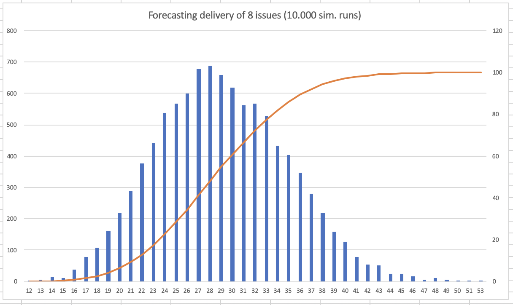
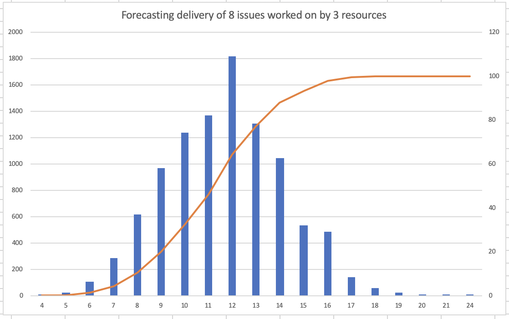
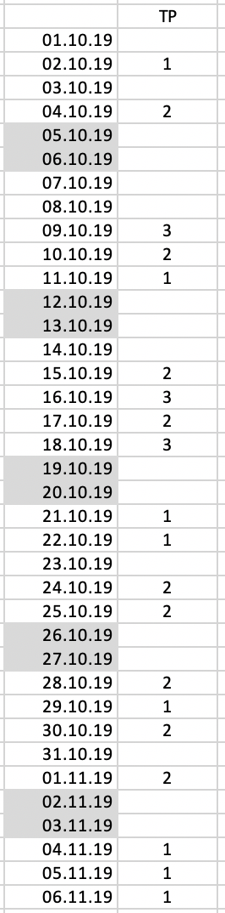
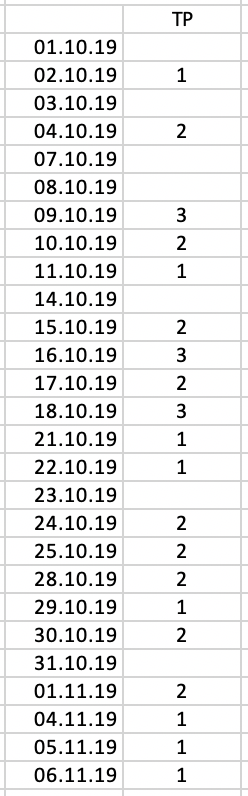

# Monte Carlo Forecasting Examples
## Forecasting train arrival time
A person wants to travel from Hamburg to Helmstedt by train. The preferred connection is:


Since the *Deutsche Bahn* has become very unreliable there is a risk of not arriving on time. But how large is the risk? What is the most probable time of arrival? Which time should be communicated to a party picking up the person at the Helmstedt train station?

With MC forecasting a forecast to answer this question can be done. Just some historical data is needed.

### Data analysis
The historical data is as follows:


The scheduled travel time is 164min (2:44h).

There is a scheduled transfer time (tt) of 16min and 9min between connecting trains.

The time it takes to change trains (ct) is assumed to be 3min.

Whether a connecting train is reached or not depends on the relation between the arriving train's delay (arrival delay (ad)) and the connecting train's departure delay (dd). The following expression has to produce `true` to make a connection:

`tt - ct - ad + dd >= 0`

Examples:

* tt=16min
* ct=3min

| ad | dd | result | connection working |
| --- | --- | --- | --- |
| 0 | 0 | 13 | true |
| 10 | 0 | 3 | true |
| 15 | 0 | -2 | false |
| 15 | 3 | 1 | true |

If a connecting train cannot be reached it is assumed that a similar train is leaving 60min later.

### Design of the combined event
In order to calculate a total travel time the historical departure/arrival data is not needed; the delays are sufficient (ad, dd).


The tuples to be generated by the simulation then look like this:

```
(
  rnd(ICE875 arrival delays),
  rnd(IC2443 delays),
  rnd(RB40 delays),
)
```

They will me mapped to the event type of the question which is a single number for the total delay.

Example: Given the simulated tuple (2,(3,6),(1,4)) the mapping proceeds like this:

* 16-3 - 2 + 3=14 -> transfer working, transfer delay so far: 0min
* 9-3 - 6 + 1=1 -> transfer working, transfer delay so far: 0min
* Finally the arrival delay of the last connection is taken as the total delay: 4min

Example: Given the simulated tuple (15,(1,1),(5,6)) the mapping proceeds like this:

* 16-3 - 15 + 1=-1 -> transfer not working, delay so far: 60min
* 9-3 - 1 + 5=10 -> transfer working, delay so far: 60min
* Finally the arrival delay of the last connection plus the transfer delay result in the total delay: 66min.

Example: Given the simulated tuple (29,(5,15),(1,7)) the mapping proceeds like this:

* 16-3 - 29 + 5=-11 -> transfer not working, delay so far: 60min
* 9-3 - 15 + 1=-8 -> transfer working, delay so far: 120min
* Finally the arrival delay of the last connection plus the transfer delay result in the total delay: 127min.

### Simulation
The simulation is working like described for the dice roles.

What's differing are the historical data:

```
var ice875_ad = new[] {0,2,4,24,9,15,14,3,18,29};
var ic2443_dd_ad = new[] { (0,0), (1,1), (3,6), (2,1), (6,12), (13,21), (4,8), (0,4), (3,7), (5,15)};
var rb40_dd_ad = new[] { (0,0), (1,4), (3,1), (1,7), (5,6), (2,3), (16,20), (1,1), (2,12), (1,18)};
```

the event tuple creation:

```
(int, (int,int), (int,int)) SimulateCombinedEvent() => (
    PickSingleEvent(ice875_ad),
    PickSingleEvent(ic2443_dd_ad),
    PickSingleEvent(rb40_dd_ad)
);
```

and especially the function to map the tuples to the question's event type:

```
int CalculateTotalDelay((int ice875_ad, (int dd, int ad) ic2443, (int dd, int ad) rb40) e) {
    const int scheduled_tt_ice875_ic2443 = 16;
    const int scheduled_tt_ic2443_rb40 = 9;
    const int change_trains_time = 3;
    
    var totalDelay = 0;

    var transfer1 = scheduled_tt_ice875_ic2443 - change_trains_time - e.ice875_ad + e.ic2443.dd;
    if (transfer1 < 0) totalDelay += 60;

    var transfer2 = scheduled_tt_ic2443_rb40 - change_trains_time - e.ic2443.ad + e.rb40.dd;
    if (transfer2 < 0) totalDelay += 60;

    totalDelay += e.rb40.ad;

    return totalDelay;
}
```

Running the MC simulation then creates a distribution like this:


From it the person travelling can pick an answer to the question according to his/her risk attitude. Maybe the person is feeling confident and "bets on" a 45% chance to arrive with a delay of 20min or less. Or the person wants to "bet on" the most probable delay: 61min, with a probability of roughly 0,1 (and a 50% chance of being that late or arriving earlier). And if there was a really important meeting for the person and he/she wants to be on the safe side then he/she could go for a 83% chance to arrive with 72min delay (or earlier).

## Forecasting software delivery
Software requirements are presented as stories. They get implemented as one or more issues.

Issues can be tagged, e.g. as "bug" or "feature" or "frontend" or "backend" or a developer's name. Also issues can be linked to a story by carrying its id.

For software delivery forecasting historical issue data consists of:

* start date
* completion date
* tags
* story id

From that the cylce time (CT) can be calculated (completion date - start date).

Example:


Forecasting software delivery means answering the question "When will it be done?" or "How long will these features take to be implemented?"

### Single issue
Forecasting single issue delivery is easy. It means just looking up a percentile in the distribution.


Delivering the next issue will take 5 or less days with a probability of around 0,85.

But if it's known that the next issue is a bug fix or a feature then the forecast can be based on the relevant subset of issues in the historical data:


For a feature issue the 0,85 probability predicts 6 days or less. But for a bug fix it's just 4 days.

### Multiple issues (single resource)
Forecasting the delivery of multiple issues requires simulation. The tuple to simulate is an array matching the number of issues to forecast. Its elements are randomly taken from the issues' historical data. Different historical data can be passed in for each issue.

The tuple's elements then are added up to give a total cycle time for all issues.

Example: Forecast the delivery of 8 issues being 3 frontend features, 1 backend bug, and a 4 backend features.

The resulting distribution then might look like this:



With a probability of around 0,83 a delivery within 33 days or less can be expected. The forecast is based on issue subsets of 13, 5, and 12 issues respectively. (The distribution is looking like a normal distribution due to the Central Limit Theorem.)

**Doing the forecast in this way assumes the issues are worked on sequentially.**

### Multiple issues I (multiple resources)
Usually more than one developer is working on issue delivery. Issues then are implemented in parallel. Issues can be assigned to each "programming resource" (a developer or a pair) to be worked on sequentially whenever a "resource" finishes an issue.

Example: 3 resources working on issues with these cycle times: 3,2,5,1,4,6,2,3

* Resource 1: 3 (∑3), 4 (∑7), 3 (∑10)
* Resource 2: 2 (∑2), 1 (∑3), 6 (∑9)
* Resource 3: 5 (∑5), 2 (∑7)

The total delivery time would be 10 days.

Algorithm: Each issue assigned to a resource prolongs its busyness. The resource to assign an issue to is the least busy one. With equal busyness issues are assigned starting at the resource with the lowest index.

Again 8 issues being 3 frontend features, 1 backend bug, and a 4 backend features are used in the following simulation with 3 resources:



The p=0,83 delivery time is 13 to 14 days or less. (If parallel work can be done in a reasonable way the employment of multiple resources speeds up delivery.)

Working with just a single resource can be viewed as a special case of multi-resource work.

Likewise single issue forecasting is a special case of multi-issue forecasting.

### Multiple issues I (throughput based)
Forecasting based on multiple resources working on issues is assuming continuous and sequential work on issues for each resource. That's the ideal case, but maybe not realistic enough.

Another approach to forecasting is more forgiving in this regard. It does not use cycle times but throughput (TP).

TP is the number of features delivered each day in the date range of the issues recorded (from earliest start date until latest completion date).

For the above historical data that leads to (including all weekends):



However, this includes weekends which did not and probably will not create throughput. Hence the working day historical data is the following:



Each run of an MC simulation starts at the same day and for each day selects a random TP value from the historical data until as many issues have been delivered as asked for.

Example: Deliver 8 issues starting on Nov. 18th 2019.

| Date | Random TP | Total issues delivered |
| --- |:---:|:---:|
| 18.11.19 | 2 | 2 |
| 19.11.19 | 0 | 2 |
| 20.11.19 | 1 | 3 |
| 21.11.19 | 1 | 4 |
| 22.11.19 | 0 | 4 |
| 23.11.19 | - | 4 |
| 24.11.19 | - | 4 |
| 25.11.19 | 3 | 7 |
| 26.11.19 | 0 | 7 |
| 27.11.19 | 1 | 8 |

In this run delivery takes 10 days: from 18.11.19 until 27.11.19. Weekends were purposefully skipped.

*Note: Selecting a subset of issues by tag is possible here too, but hardly produces good forecasting results because the throughput data per tag combination might be very scarce.*

The result of 10.000 simulation runs could look like this:


The p=0,83 forecast is 10 days or less. It seems, not strictly assigning resources to issues helps to deliver faster.

### Story refinement 


